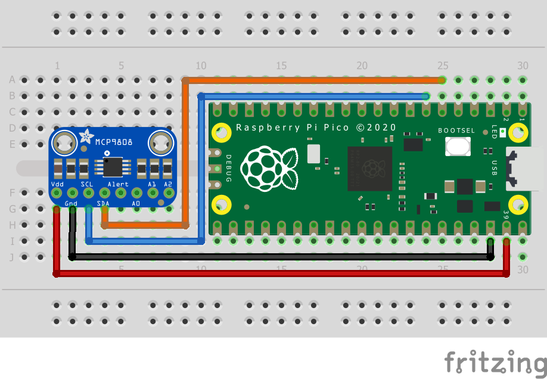

= Attaching the Useful Sensors person sensor via I2C

This example code shows how to interface the Raspberry Pi Pico to the person sensor board. 

== Wiring information

Wiring up the device requires 4 jumpers, to connect VDD, GND, SDA and SCL. The example here uses I2C port 0, which is assigned to GPIO 4 (SDA) and 5 (SCL) in software. Power is supplied from the VSYS pin.

Follow the same wiring scheme as the MCP9808 shown below:

[[mcp9808_i2c_wiring]]
[pdfwidth=75%]
.Wiring Diagram for MCP9808.

== List of Files

CMakeLists.txt:: CMake file to incorporate the example in to the examples build tree.
person_sensor_i2c.c:: The example code.
